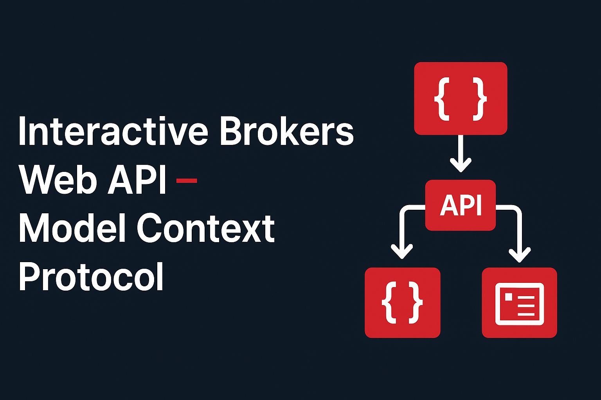
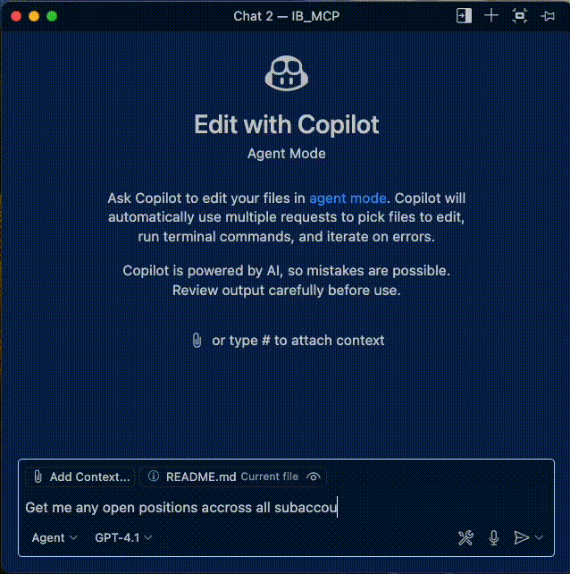
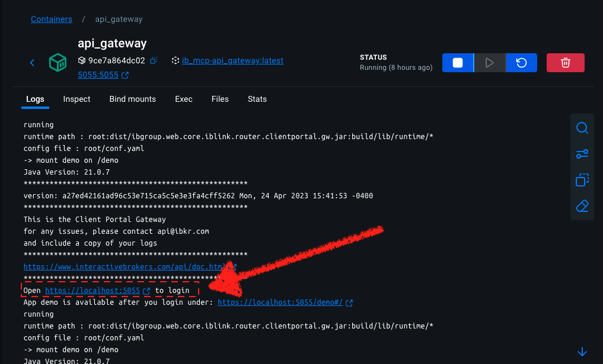

<div align="center">




[](LICENSE)



</div>

> [!Note]
>
> #### Project Status
> This project is currently under active development. Features may be incomplete, and breaking changes may occur.

## Table of Contents
- [Table of Contents](#table-of-contents)
- [Overview](#overview)
- [Architecture](#architecture)
  - [📦 Interactive Brokers Client Portal Gateway Docker Container](#-interactive-brokers-client-portal-gateway-docker-container)
      - [🔧 What This Container Does](#-what-this-container-does)
  - [📦 Interactive Brokers Routers Generator Docker Container \[WIP\]](#-interactive-brokers-routers-generator-docker-container-wip)
  - [📦 IB MCP Server Docker Container](#-ib-mcp-server-docker-container)
      - [🔧 What This Container Does](#-what-this-container-does-1)
- [Docker Desktop Setup](#docker-desktop-setup)
  - [Limitations of Multi-Container Setup](#limitations-of-multi-container-setup)
  - [Session Management](#session-management)
  - [Future Work](#future-work)
  - [Endpoints Status](#endpoints-status)
- [Limitations](#limitations)
- [References](#references)
- [Contributing](#contributing)
- [License](#license)

## Overview

This project provides an Interactive Brokers (IB) API interface using the Model Context Protocol (MCP). There are several ways to interact with Interactive Brokers, like the [TWS API](https://www.interactivebrokers.com/campus/ibkr-api-page/twsapi-doc/), the WEB API, [Excel RTD](https://www.interactivebrokers.com/campus/ibkr-api-page/excel-rtd/#introduction) and FIX among others. This project is built on top of Interactive Brokers [WEB API](https://www.interactivebrokers.com/campus/ibkr-api-page/webapi-doc/#introduction-0).

This development uses the retail authentication process which is managed using the Client Portal Gateway, a small Java program used to route local web requests with appropriate authentication. 

## Architecture

The project consists of 4 main components:

*   **api_gateway:** Runs the Interactive Brokers Client Portal Gateway in a Docker container to enable secure access to the IB REST API.
*   **ticker_service:** This service is responsible for maintaining the Interactive Brokers session by periodically calling the `/tickle` endpoint to prevent session timeouts, as detailed in the 'Reopen Session' section. This service runs in a Docker container.
*   **routers_generator:** Based on official documentation it automatically creates FastAPI routers and saves them in the routers directory.
*   **mcp_server:** MCP server built with FastMCP that interacts with API gateway by adding the routers previously generated This service also runs in a Docker container.


### 📦 Interactive Brokers Client Portal Gateway Docker Container

This Docker container sets up and runs the **Interactive Brokers (IB) Client Portal Gateway**, which is required for applications to connect via the IB REST API.

##### 🔧 What This Container Does

- **Base Image**: Uses `eclipse-temurin:21` (Java 21) for compatibility with the IB Gateway.
- **Installs Dependencies**: Installs `unzip` for extracting the gateway archive.
- **Downloads Gateway**: Fetches the latest version of the Client Portal Gateway from the official Interactive Brokers source and unzips it.
- **Configuration**:
  - Copies a custom `conf.yaml` into the expected path (`gateway/root/conf.yaml`) to configure the gateway.
  - Adds a custom `run_gateway.sh` script as the container entrypoint.
- **Port Exposure**: Exposes port `5055` (default port used by the gateway). Override as needed in .env.
- **Startup Command**: Runs the gateway using the configuration file.

This setup provides a self-contained, reproducible environment for securely running the Interactive Brokers REST API gateway in a containerized environment.

### 📦 Interactive Brokers Routers Generator Docker Container [WIP]

Routers are currently manually developed as the official Open Api Json file fails validations. See [Future Work](#future-work) and [Endpoints Status](#endpoints-status)

### 📦 IB MCP Server Docker Container
This Docker container sets up and runs the **Interactive Brokers (IB) Model Context Protocol (MCP) Server**, which provides an interface for interacting with the IB API gateway.

##### 🔧 What This Container Does

- **Base Image**: Uses `ghcr.io/astral-sh/uv:python3.11-bookworm-slim` for a lightweight Python 3.11 environment with `uv`.
- **Installs Dependencies**: Installs `curl` for system dependencies and uses `uv sync` to install Python dependencies from `pyproject.toml`.
- **Configuration**: Copies the `pyproject.toml` and the entire `mcp_server` directory into the container. Sets `PYTHONPATH` to `/app` and `UV_CACHE_DIR` to `/tmp/uv-cache`.
- **Port Exposure**: Exposes the port specified by the `MCP_SERVER_PORT` environment variable (e.g., `5002`).
- **Startup Command**: Runs the FastAPI server using `uv run -- python /app/mcp_server/fastapi_server.py`.

This setup provides a containerized environment for the MCP server, enabling it to communicate with the IB Client Portal Gateway.


## Docker Desktop Setup

See a quick walktrough in [YOUTUBE](https://www.youtube.com/watch?v=PyQz_kMQ9ek)

1. Clone the repo, set env variables and build the images
    ```bash
    # Clone the repository
    git clone https://github.com/rcontesti/IB_MCP.git

    # Navigate to the project directory
    cd IB_MCP

    # Copy the .env.example file to .env and edit as needed
    cp .env.example .env

    # Build the image
    docker compose up --build -d

    ```
2. Auth with your IB account and credentials to:
    After the image is up and running, navigate to `https://{GATEWAY_BASE_URL}:{GATEWAY_PORT}`⁠ (e.g.: `https://localhost:5055/`) to login.
    You will also find the login path in the logs of the API gateway container:
    
    If successful you should be redirected to a URL that reads: "Client login succeeds".

3. Add the MCP server config file to your VS Code `settings.json`.

    Given the following environment parameters
    ```
    MCP_SERVER_HOST=0.0.0.0
    MCP_SERVER_PORT=5002
    MCP_SERVER_PATH=/mcp
    MCP_TRANSPORT_PROTOCOL=streamable-http
    ```

    the VS Code MCP server snippet in `settings.json` would look like:

    ```json
    {
      ...
        },
        "chat.mcp.discovery.enabled": true,
        "mcp": {
            "inputs": [],
            "servers": {
                "time": {
                "command": "docker",
                "args": ["run", "-i", "--rm", "mcp/time"]
                },
                "ib-web": {
                    "type": "http",
                    "url": "http://localhost:5002/mcp/",
                }
            }
        },
        "workbench.colorTheme": "Tomorrow Night Blue"
    }
    ```
    Check [Use MCP servers in VS Code (Preview)](https://code.visualstudio.com/docs/copilot/chat/mcp-servers) for further reference.

4. Start the MCP in Copilot


### Limitations of Multi-Container Setup

- Users must log in through the browser on the same machine as Client Portal Gateway in order to authenticate.
- All API Endpoint calls must be made on the same machine where the Client Portal Gateway was authenticated.
- None of the endpoints beginning with /gw/api, /oauth, or /oauth2 are supported for use in the Client Portal Gateway.

### Session Management

The additional /iserver/auth/ssodh/init endpoint is used to subsequently reopen a brokerage session with the backend, through which you can access the protected /iserver endpoints.

Sessions will time out after approximately 6 minutes without sending new requests or maintaining the /tickle endpoint at least every 5 minutes.

In order to prevent the session from timing out, the endpoint /tickle should be called on a regular basis. It is recommended to call this endpoint approximately every minute.

If the brokerage session has timed out but the session is still connected to the IBKR backend, the response to /auth/status returns ‘connected’:true and ‘authenticated’:false. Calling the /iserver/auth/ssodh/init endpoint will initialize a new brokerage session.

### Future Work
- Automatically generate endpoints
  - Currently the [IB REST API (2.16.0) OpenAPI specification](https://api.ibkr.com/gw/api/v3/api-docs) fails validation, and the automated router generation feature is currently failing to generate routers. You can try to validate yourself here:

  - https://oas-validation.com/
  - https://editor.swagger.io/

  The spec currently has 351 errors. Therefore, router endpoints are currently being built manually, and their status is updated upon completion.
  - Due to issues with the official OpenAPI specification and the IB team's current focus, automated router generation is not feasible at this time, and routers are being built manually.
- Add OAuth

### Endpoints Status

Endpoints are currently manuallu built.

👉 See the full list of [API Endpoints Staus](ENDPOINTS.md)


## Limitations

- **Claude Desktop:** The current development only supports streamable HTTP and claude desktop Remote MCP server support is currently in beta and available for users on Claude Pro, Max, Team, and Enterprise plans (as of June 2025).
- **Cline:** Cline still has issues with streamble HTTP with remote servers

## References
- [IB WEB API Reference](https://www.interactivebrokers.com/campus/ibkr-api-page/webapi-ref/)
- [IB WEB API openapi docs](https://api.ibkr.com/gw/api/v3/api-docs) Outdated!
- [IB WEB API Reference page](https://www.interactivebrokers.com/campus/ibkr-api-page/cpapi-v1/#introduction) 
  
- [FAST MCP](https://github.com/jlowin/fastmcp)
- [FAST MCP Documentation](https://gofastmcp.com/servers/fastmcp)
- [FAST MCP openapi integration](https://gofastmcp.com/servers/openapi)

- [ibeam](https://github.com/Voyz/ibeam)
- [fastapi-codegen](https://github.com/koxudaxi/fastapi-code-generator)
- [openapi spec validator repo](https://github.com/python-openapi/openapi-spec-validator)
- [openapi spec validator docs](https://openapi-spec-validator.readthedocs.io/en/latest/python.html)

## Contributing
We welcome contributions to this project! If you'd like to contribute, please follow these guidelines:

1.  **Fork the repository** and create your branch from `main`.
2.  **Report bugs** by opening an issue with a clear description and steps to reproduce.
3.  **Suggest features** by opening an issue to discuss your ideas.
4.  **Submit pull requests** for bug fixes, new features, or improvements. Please ensure your code adheres to the existing style, includes relevant tests, and has clear commit messages.

## License
This project is licensed under the MIT License - see the [LICENSE](LICENSE) file for details.
